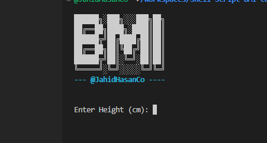
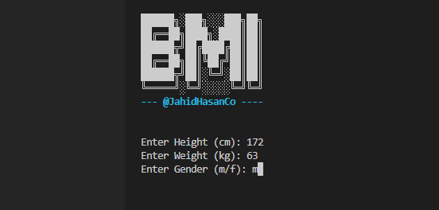
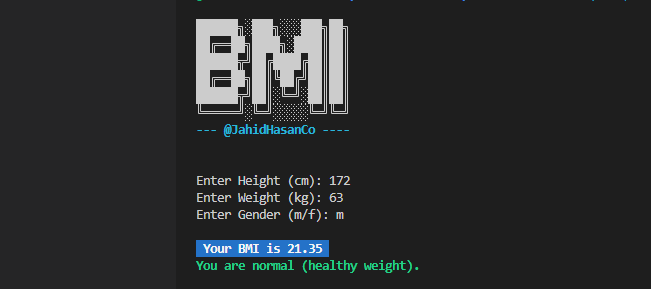
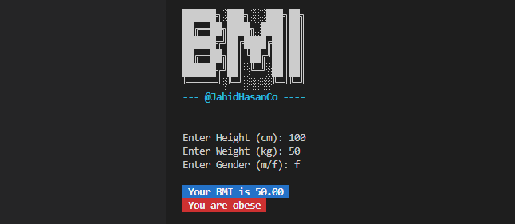

# Shell Script BMI Calculator

Body Mass Index (BMI) is a person's weight in kilograms (or pounds) divided by the square of height in meters (or feet). A high BMI can indicate high body fatness.

# Preview
`logo`

`Enter Value`

`Normal BMI Result`

`Obese BMI Result`

